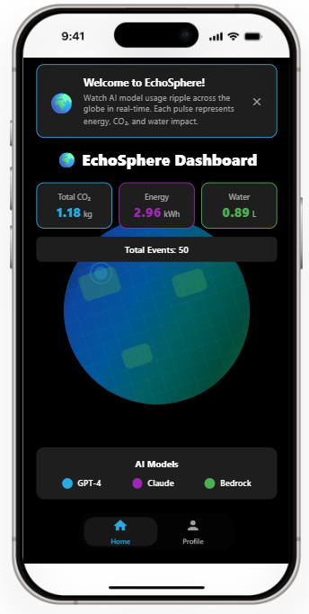

# 🌍 EchoSphere

**Real-time AI Environmental Impact Visualization**

[](https://github.com/aaravhmodi/echosphere)

## 🎬 Demo

**Live Demo**

https://github.com/user-attachments/assets/25f23865-1313-4593-a150-9d47450daf1a


### Demo Files
- **📱 App Demo**: [`demo/echosphere-demo.mp4`](demo/echosphere-demo.mp4) - Full video demonstration
- **📸 Screenshots**: [`demo/screenshot.png`](demo/screenshot.png) - Static app interface

### Features in Action
- 🌍 **Rotating Globe**: Continuously animated 3D-style Earth
- 💫 **Live Ripples**: Color-coded pulses representing AI model usage
- 📊 **Real-time Stats**: Cumulative CO₂, energy, and water impact
- 🎨 **Visual Impact**: Each ripple shows the environmental cost of AI inference

## 🎯 Mission

EchoSphere makes the invisible cost of AI visible. Through simulated AI activity rendered on a glowing, animated Earth, it turns data into empathy—bridging sustainability, creativity, and technology in a single, elegant experience.

## 🏗️ Technical Architecture

### Core Technologies
- **Framework**: React Native with Expo SDK 54.0.1
- **Language**: TypeScript with strict mode enabled
- **Animation**: React Native Reanimated v4 with 60fps performance
- **Navigation**: Expo Router with file-based routing
- **State Management**: React Hooks + Context API
- **Platform Support**: iOS, Android, Web (PWA enabled)

### System Architecture
```
┌─────────────────┐    ┌──────────────────┐    ┌─────────────────┐
│   UI Layer      │    │  Business Logic  │    │  Data Layer     │
│                 │    │                  │    │                 │
│ • GlobeViz      │◄──►│ • AISimulator    │◄──►│ • ImpactCalc    │
│ • StatsOverlay  │    │ • EventGenerator │    │ • TypeDefs      │
│ • ModelLegend   │    │ • StateManager   │    │ • Constants     │
└─────────────────┘    └──────────────────┘    └─────────────────┘
```

### Performance Optimizations
- **Ripple Management**: Maximum 20 concurrent ripples with automatic cleanup
- **Animation Efficiency**: Shared values for 60fps smooth animations
- **Memory Management**: Automatic ripple removal after 2-second lifecycle
- **Coordinate Projection**: Optimized lat/lon to x/y conversion algorithms

## 🔬 Technical Implementation

### AI Event Simulation Engine
```typescript
interface AIEvent {
  id: string;
  model: 'gpt-4' | 'claude' | 'bedrock';
  tokens: number;
  impact: Impact;
  location: Location;
  timestamp: number;
}
```

### Environmental Impact Calculation
```typescript
// Mathematical model for environmental impact
const calculateImpact = (tokens: number): Impact => {
  const energy_kwh = tokens * 0.00005;  // Energy per token
  const co2_kg = energy_kwh * 0.4;      // CO2 conversion factor
  const water_l = energy_kwh * 0.3;     // Water usage factor
  
  return {
    energy_kwh: parseFloat(energy_kwh.toFixed(6)),
    co2_kg: parseFloat(co2_kg.toFixed(6)),
    water_l: parseFloat(water_l.toFixed(6))
  };
};
```

### Globe Visualization System
- **Projection Algorithm**: Custom lat/lon to circular coordinate mapping
- **Animation Pipeline**: Continuous rotation with linear easing
- **Ripple Physics**: Scale and opacity interpolation over 2000ms
- **Performance**: 60fps with React Native Reanimated worklets

### AI Model Configuration
```typescript
const AI_MODELS = {
  'gpt-4': { color: '#29ABE2', name: 'GPT-4' },
  'claude': { color: '#9C27B0', name: 'Claude' },
  'bedrock': { color: '#4CAF50', name: 'Bedrock' }
};
```

## 📊 Environmental Impact Metrics

### Real-time Data Processing
- **Event Frequency**: 1-3 second intervals with random distribution
- **Token Range**: 500-2000 tokens per simulated event
- **Geographic Distribution**: Random global coordinates (-60° to 70° lat)
- **Cumulative Tracking**: Real-time aggregation of environmental metrics

### Mathematical Models
```typescript
// Energy consumption model
energy_kwh = tokens × 0.00005

// CO2 emissions model  
co2_kg = energy_kwh × 0.4

// Water usage model
water_l = energy_kwh × 0.3
```

## 🎨 Visual Design System

### Color Palette
```typescript
const colors = {
  background: '#000000',        // OLED-optimized black
  text: '#FFFFFF',              // High contrast white
  primary: '#29ABE2',           // GPT-4 blue
  secondary: '#9C27B0',         // Claude purple
  accent: '#4CAF50',            // Bedrock green
  card: '#1E1E1E',              // Dark surface
  highlight: '#FFEB3B'          // Interactive elements
};
```

### Animation Specifications
- **Globe Rotation**: 60-second full rotation cycle
- **Ripple Duration**: 2000ms with ease-out timing
- **Fade Transition**: Opacity interpolation from 1.0 to 0.0
- **Scale Animation**: Linear scale from 0 to 1.0

## 🏗️ Project Structure

```
echosphere/
├── app/                           # Expo Router file-based routing
│   ├── _layout.tsx               # Root layout with theme provider
│   └── (tabs)/                   # Tab navigation system
│       ├── (home)/               # Main visualization screen
│       └── profile.tsx           # Technical documentation screen
├── components/                    # Reusable UI components
│   ├── GlobeVisualization.tsx    # Core 3D globe rendering
│   ├── StatsOverlay.tsx          # Real-time metrics display
│   ├── ModelLegend.tsx           # AI model color coding
│   ├── InfoBanner.tsx            # User interface notifications
│   └── FloatingTabBar.tsx        # Custom navigation component
├── contexts/                      # React context providers
│   └── WidgetContext.tsx         # iOS widget integration
├── types/                         # TypeScript type definitions
│   └── echosphere.ts             # Core data structures
├── utils/                         # Business logic utilities
│   ├── aiSimulator.ts            # AI event generation engine
│   ├── impactCalculator.ts       # Environmental impact algorithms
│   └── errorLogger.ts            # Error tracking and logging
├── styles/                        # Centralized styling system
│   └── commonStyles.ts           # Design system constants
└── assets/                        # Static resources
    ├── fonts/                     # Custom typography
    └── images/                    # Visual assets
```

## 🚀 Development Setup

### Prerequisites
- **Node.js**: v16+ (LTS recommended)
- **npm**: v8+ or **yarn**: v1.22+
- **Expo CLI**: Global installation recommended
- **Platform SDKs**: iOS Simulator (macOS) or Android Studio

### Installation & Execution

```bash
# Repository cloning
git clone https://github.com/aaravhmodi/echosphere.git
cd echosphere

# Dependency installation
npm install

# Development server startup
# Windows PowerShell
$env:EXPO_NO_TELEMETRY=1; npx expo start --tunnel

# macOS/Linux
EXPO_NO_TELEMETRY=1 npx expo start --tunnel
```

### Platform-Specific Execution
- **Web**: `http://localhost:8081` (automatic browser launch)
- **iOS**: Press `i` in terminal (requires Xcode)
- **Android**: Press `a` in terminal (requires Android Studio)
- **Mobile**: Scan QR code with Expo Go app

## 🔧 Technical Configuration

### TypeScript Configuration
```json
{
  "extends": "@expo/tsconfig.base",
  "compilerOptions": {
    "strict": true,
    "baseUrl": ".",
    "jsx": "react-jsx",
    "paths": { "@/*": ["./*"] }
  }
}
```

### Babel Configuration
```javascript
module.exports = {
  presets: ["babel-preset-expo"],
  plugins: [
    "module-resolver",
    "@babel/plugin-proposal-export-namespace-from",
    "react-native-worklets/plugin"
  ]
};
```

### Metro Configuration
- **Bundler**: Metro with Expo optimizations
- **Asset Resolution**: Automatic platform-specific file resolution
- **Hot Reloading**: Enabled for development
- **Source Maps**: Full source mapping support

## 🎮 System Workflow

### Event Generation Pipeline
1. **Timer-based Trigger**: 1-3 second random intervals
2. **Model Selection**: Random selection from configured AI models
3. **Token Generation**: 500-2000 token range with uniform distribution
4. **Impact Calculation**: Real-time environmental impact computation
5. **Coordinate Mapping**: Geographic projection to circular coordinates
6. **Visual Rendering**: Ripple animation with color-coded model representation

### State Management Architecture
```typescript
// Global state structure
interface AppState {
  ripples: Ripple[];           // Active ripple animations
  stats: CumulativeStats;      // Aggregated metrics
  isRunning: boolean;          // Simulation state
}

// State updates via React hooks
const [ripples, setRipples] = useState<Ripple[]>([]);
const [stats, setStats] = useState<CumulativeStats>(initialStats);
```

### Performance Monitoring
- **FPS Tracking**: 60fps target with React Native Reanimated
- **Memory Management**: Automatic cleanup of expired ripples
- **Bundle Size**: Optimized with tree-shaking and code splitting
- **Platform Optimization**: Native performance on iOS/Android

## 🎨 Customization & Extension

### Adding AI Models
```typescript
// 1. Update type definitions
interface AIModel {
  id: string;
  name: 'gpt-4' | 'claude' | 'bedrock' | 'new-model';
  color: string;
}

// 2. Add model configuration
const AI_MODELS = {
  'new-model': { color: '#FF6B35', name: 'New Model' }
};

// 3. Update color mapping function
export function getModelColor(model: string): string {
  return AI_MODELS[model]?.color || '#FFFFFF';
}
```

### Modifying Impact Algorithms
```typescript
// Custom environmental impact calculation
export function calculateCustomImpact(tokens: number): Impact {
  const baseEnergy = tokens * 0.00005;
  const energy_kwh = baseEnergy * customMultiplier;
  const co2_kg = energy_kwh * customCO2Factor;
  const water_l = energy_kwh * customWaterFactor;
  
  return { energy_kwh, co2_kg, water_l };
}
```

## 🚀 Deployment & Distribution

### Web Deployment (PWA)
```bash
npm run build:web
# Generates optimized web build with Workbox PWA support
```

### Mobile App Distribution
```bash
# Android APK generation
npm run build:android

# iOS App Store preparation (macOS required)
npm run ios
```

### Performance Optimization
- **Code Splitting**: Lazy loading of non-critical components
- **Asset Optimization**: Compressed images and fonts
- **Bundle Analysis**: Webpack bundle analyzer integration
- **Caching Strategy**: Service worker for offline functionality

## 📊 Technical Metrics

### Performance Benchmarks
- **Initial Load**: < 3 seconds on 3G connection
- **Animation FPS**: Consistent 60fps on modern devices
- **Memory Usage**: < 100MB peak memory consumption
- **Bundle Size**: < 2MB compressed web bundle

### Browser Compatibility
- **Chrome**: v90+ (full support)
- **Firefox**: v88+ (full support)
- **Safari**: v14+ (full support)
- **Edge**: v90+ (full support)

## 🤝 Contributing Guidelines

### Development Workflow
1. **Fork Repository**: Create personal fork
2. **Feature Branch**: `git checkout -b feature/feature-name`
3. **Code Standards**: Follow TypeScript strict mode
4. **Testing**: Ensure 60fps performance on target devices
5. **Pull Request**: Detailed description with performance impact

### Code Quality Standards
- **TypeScript**: Strict mode enabled
- **ESLint**: Expo configuration with custom rules
- **Performance**: React Native Reanimated best practices
- **Accessibility**: WCAG 2.1 AA compliance

## 📄 License & Acknowledgments

**License**: MIT License - See [LICENSE](LICENSE) for details

**Acknowledgments**:
- Built for environmental sustainability awareness
- Inspired by the need to visualize AI's hidden environmental costs
- React Native Reanimated for high-performance animations

---

